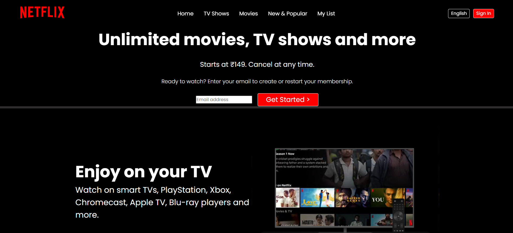

# 🎬 Netflix Clone

<div align="center">


[](https://github.com/dhruvjohri/netflix-clone/stargazers)
[](https://github.com/dhruvjohri/netflix-clone/issues)
[](https://github.com/dhruvjohri/netflix-clone/pulls)
[](https://github.com/dhruvjohri/netflix-clone/network)

</div>

---
<div align="centre">
## 🌟 **Show Your Support!**
</div>
<div align="center">

### ⭐ **Star this Repository** ⭐
*Help us reach more developers by starring this repo!*

[](https://github.com/dhruvjohri/netflix-clone)

### 📣 **Connect with Me**

[](https://x.com/DhruvJohri_)
[](https://github.com/dhruvjohri)

</div>

---

## 📋 **Table of Contents**

- [📌 Overview](#-overview)
- [✨ Features](#-features)
- [🖼️ Preview](#️-preview)
- [🛠️ Tech Stack](#️-tech-stack)
- [🚀 Getting Started](#-getting-started)
- [📁 Project Structure](#-project-structure)
- [🤝 Contributing to GSSoC 2025](#-contributing-to-gssoc-2025)
- [📋 Contribution Guidelines](#-contribution-guidelines)
- [🌟 How to Contribute](#-how-to-contribute)
- [📊 Project Statistics](#-project-statistics)
- [👥 Contributors](#-contributors)
- [🏆 GSSoC 2025 Guidelines](#-gssoc-2025-guidelines)
- [📄 License](#-license)
- [🙏 Acknowledgments](#-acknowledgments)

---

## 📌 **Overview**

<div align="center">

🎯 **A pixel-perfect, responsive clone of Netflix India's homepage**

</div>

This project is a **beginner-friendly frontend challenge** that focuses on:
- 🎨 **Clean UI/UX Design** - Mimicking Netflix's modern interface
- 📱 **Responsive Layout** - Works seamlessly across all devices
- 🚀 **Performance Optimized** - Fast loading and smooth interactions
- 🔧 **Educational Purpose** - Perfect for learning HTML5 & CSS3

Originally created by **[Dhruv Johri](https://github.com/dhruvjohri)** and now enhanced by the amazing open-source community under **GSSoC 2025**.

---

## ✨ **Features**

<div align="center">

| Feature | Description | Status |
|---------|-------------|--------|
| 🎬 **Hero Section** | Eye-catching banner with Netflix branding | ✅ Complete |
| 📱 **Responsive Design** | Mobile-first approach with breakpoints | ✅ Complete |
| 🎭 **Movie Carousel** | Interactive movie/show browsing | 🚧 In Progress |
| 🔍 **Search Functionality** | Search movies and shows | 📋 Planned |
| 👤 **User Profiles** | Multiple user profile support | 📋 Planned |
| 🌙 **Dark Mode** | Toggle between light and dark themes | 📋 Planned |

</div>

---

## 🖼️ **Preview**

<div align="center">

### 🖥️ **Desktop View**
<!--  -->



### 📱 **Mobile Responsive** (Coming Soon)
*Screenshots will be added as mobile responsiveness is enhanced*

</div>

---

## 🛠️ **Tech Stack**

<div align="center">

| Technology | Usage | Badge |
|------------|-------|-------|
|  | Structure & Semantics | Core |
|  | Styling & Layout | Core |
|  | Flexible Layouts | Layout |
|  | Grid Layouts | Layout |
|  | Media Queries | Design |

</div>

---

## 🚀 **Getting Started**

### 📋 **Prerequisites**

Before you begin, ensure you have:

- ✅ **Code Editor** (VS Code, Sublime Text, or any preferred editor)
- ✅ **Web Browser** (Chrome, Firefox, Safari, or Edge)
- ✅ **Git** (for version control)
- ✅ **Basic knowledge** of HTML and CSS

### 🛠️ **Installation**

#### **Method 1: Clone Repository**

```bash
# 1️⃣ Clone the repository
git clone https://github.com/dhruvjohri/netflix-clone.git

# 2️⃣ Navigate to project directory
cd netflix-clone

# 3️⃣ Open in your preferred code editor
code .  # For VS Code users
```

#### **Method 2: Download ZIP**

1. Click on **"Code"** button above
2. Select **"Download ZIP"**
3. Extract the downloaded file
4. Open `index.html` in your browser

---

## 📁 **Project Structure**

```
netflix-clone/
├── 📄 index.html              # Main HTML file
├── 📁 css/
│   ├── 🎨 style.css           # Main stylesheet
│   ├── 📱 responsive.css      # Media queries
│   └── 🎭 components.css      # Component styles
├── 📁 assets/
│   ├── 🖼️ images/             # Image assets
│   ├── 🎬 videos/             # Video assets (if any)
│   └── 🔤 fonts/              # Custom fonts
├── 📁 js/                     # JavaScript files (future)
├── 📄 README.md               # Project documentation
├── 📄 LICENSE                 # MIT License
└── 📄 CONTRIBUTING.md         # Contribution guidelines
```

---

## 🤝 **Contributing to GSSoC 2025**

<div align="center">


**🎉 We're excited to be part of GSSoC 2025! 🎉**

</div>

### 🌟 **Why Contribute?**

- 🏆 **Gain Experience** - Work on real-world projects
- 🤝 **Build Network** - Connect with amazing developers
- 📈 **Enhance Skills** - Learn from code reviews and feedback
- 🎯 **Make Impact** - Contribute to open-source ecosystem
- 🏅 **Earn Recognition** - Get featured in our contributors list

---

## 📋 **Contribution Guidelines**

### 🎯 **How to Get Started**

1. **🍴 Fork the Repository**
   ```bash
   # Click the "Fork" button at the top right of this page
   ```

2. **📥 Clone Your Fork**
   ```bash
   git clone https://github.com/YOUR_USERNAME/netflix-clone.git
   cd netflix-clone
   ```

3. **🌿 Create a New Branch**
   ```bash
   git checkout -b feature/your-feature-name
   # or
   git checkout -b fix/bug-description
   ```

4. **⚡ Make Your Changes**
   - Write clean, readable code
   - Follow existing code style
   - Test your changes thoroughly

5. **💾 Commit Your Changes**
   ```bash
   git add .
   git commit -m "✨ Add: Your descriptive commit message"
   ```

6. **🚀 Push to Your Fork**
   ```bash
   git push origin feature/your-feature-name
   ```

7. **🔄 Create Pull Request**
   - Go to your fork on GitHub
   - Click "New Pull Request"
   - Fill out the PR template
   - Wait for review!

---

## 🌟 **How to Contribute**

### 🎨 **Frontend Improvements**
- [ ] **Mobile Responsiveness** - Enhance mobile experience
- [ ] **Accessibility** - Add ARIA labels and keyboard navigation
- [ ] **Performance** - Optimize images and CSS
- [ ] **Animations** - Add smooth transitions and hover effects

### 🔧 **Feature Additions**
- [ ] **Search Functionality** - Implement movie/show search
- [ ] **Movie Details** - Create detailed movie pages
- [ ] **User Profiles** - Add multiple profile support
- [ ] **Watchlist** - Implement favorites/watchlist feature

### 📚 **Documentation**
- [ ] **Code Comments** - Add detailed code documentation
- [ ] **Setup Guides** - Create deployment guides
- [ ] **API Documentation** - Document any future APIs
- [ ] **Tutorial Videos** - Create learning resources

### 🐛 **Bug Fixes**
- [ ] **Cross-browser Issues** - Fix compatibility problems
- [ ] **Layout Issues** - Resolve responsive design bugs
- [ ] **Performance Issues** - Fix loading and rendering problems

---

## 📊 **Project Statistics**

<div align="center">


</div>

---

## 👥 **Contributors**

<div align="center">

### 🌟 **Hall of Fame** 🌟

We're grateful to all our amazing contributors who have helped make this project better!

</div>

| Avatar | Name | Role | Contributions |
|--------|------|------|---------------|
|  | **Dhruv Johri** | 👑 **Project Creator** | Initial project setup, Core development |
| 🎯 |**Your Name Here**|  🌱**New Contributor** | *Contribute and see your name here!* |
| 🎯 | **Your Name Here** | 🌱 **New Contributor** | *Contribute and see your name here!* |

<div align="center">

[](https://github.com/dhruvjohri/netflix-clone/graphs/contributors)

**💡 Want to see your avatar here? [Contribute now!](#-how-to-contribute)**

</div>

---

## 🏆 **GSSoC 2025 Guidelines**

### 📋 **For Participants**

#### ✅ **Do's**
- ✅ **Read documentation** thoroughly before contributing
- ✅ **Follow code style** and project structure
- ✅ **Write descriptive** commit messages
- ✅ **Test your changes** before submitting PR
- ✅ **Be respectful** and collaborative
- ✅ **Ask questions** if you're unsure about anything

#### ❌ **Don'ts**
- ❌ **Don't spam** with multiple PRs for same issue
- ❌ **Don't copy code** without understanding
- ❌ **Don't make unnecessary** changes
- ❌ **Don't ignore** code review feedback
- ❌ **Don't forget** to update documentation when needed

### 🎯 **Contribution Levels**

| Level | Description | Points | Badge |
|-------|-------------|--------|-------|
| 🥉 **Beginner** | Fix typos, update docs, minor bug fixes | 5-10 |  |
| 🥈 **Intermediate** | Add features, improve UI/UX, performance | 15-25 |  |
| 🥇 **Advanced** | Major features, architecture improvements | 30-50 |  |

---

## 📄 **License**

This project is licensed under the **MIT License** - see the [LICENSE](LICENSE) file for details.

### ⚖️ **Important Notice**
- **Netflix®** branding, logos, and visuals are owned by **Netflix, Inc.**
- This project is for **educational purposes only**
- Not affiliated with or endorsed by Netflix, Inc.
- All trademarks belong to their respective owners

---

## 🙏 **Acknowledgments**

<div align="center">

### 🌟 **Special Thanks**

</div>

- 🎓 **[GirlScript Summer of Code 2025](https://gssoc.girlscript.tech/)** - For supporting open source
- 🚀 **[GitHub](https://github.com)** - For hosting our code
- 🎨 **[Netflix](https://netflix.com)** - For the design inspiration
- 👥 **Open Source Community** - For continuous support and contributions
- 💡 **All Contributors** - For making this project awesome

### 🔗 **Useful Resources**

- 📚 **[HTML5 Documentation](https://developer.mozilla.org/en-US/docs/Web/HTML)**
- 🎨 **[CSS3 Documentation](https://developer.mozilla.org/en-US/docs/Web/CSS)**
- 📱 **[Responsive Design Guide](https://web.dev/responsive-web-design-basics/)**
- 🛠️ **[Git Cheat Sheet](https://education.github.com/git-cheat-sheet-education.pdf)**

---

<div align="center">

### 🎉 **Ready to Contribute?**

[](https://github.com/dhruvjohri/netflix-clone/issues)

### 💬 **Join Our Community**

[](#)
[](#)

---

### ⭐ **Don't forget to star this repository!** ⭐

**Made with ❤️ by [Dhruv Johri](https://github.com/dhruvjohri) and the Open Source Community**


</div>
